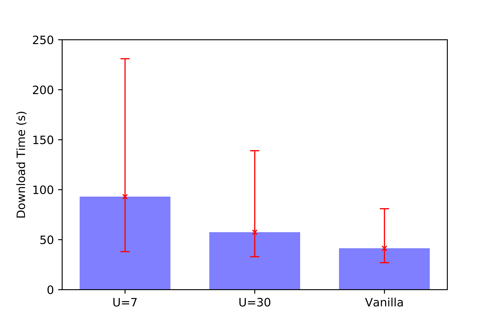

# Reimplementation of BitTyrant: Do Incentives Build Robustness in BitTorrent?

Gongqi Huang and Jingyuan Chen, COS 518, 2022

## Introduction
In peer-to-peer systems, a fundamental challenge is to disincentivize peers to
free-ride by consuming others' resources without contributing to the system. In
the BitTorrent file distribution protocol, each peer downloads file contents from
other peers while contributing its own upload bandwidth to transfer contents to
others. A strategy called tit-for-tat is used to explicitly address the issue,
under which each peer only donate certain amount of upload bandwidth to another peer
if that peer has donated relatively the same amount to it. Such a rule encourages
the peers to be altruistic since peers who don't upload can't expect to download
from other peers.

More specifically, BitTorrent peers attempt to maximize their downloading
speed by downloading from any peer who sends pieces (file blocks of fixed size)
to them and upload pieces to the top $k$ peers who contribute the most to them.
In addition, they will split their upload bandwidth into $k$ "fractions" and allocate
each fraction to one of the top k peers. This bandwidth is called the
"equal-split bandwidth", and the set of the top k peers is called the "active set".
The action of not sending to peers who didn't contribute enough is called "choking",
and the action of sending to the peers who reciprocated is called "unchoking".
To prevent low capacity peers from being starved, the Bittorrent protocol also
let peers to "optimistically unchoke" random selected peers periodically. If a peer A
is optimiscially unchoked by a peer B, B will uploads at the equal-split rate to
A for a period of time no matter how much A has contributed to B.

Although BitTorrent has had a great success in the real world deployment, which
seems to be a proof of how robust the incentive mechanism is [[1]](#1), it is actually
amenable to strategic peers. The BitTyrant paper [[2]](#2) represented an approach that
utilizes the existence of altruism in BitTorrent to build a selfish strategic BitTorrent
client called BitTyrant. BitTyrant carefully selects peers and contribution rates and
could break the robustness of BitTorrent by benefiting from other peers' uploads while
contributing at only much lower rate.

### BitTyrant
BitTyrant can achieve higher download speeds at lower "uploading costs" by utilizing
a few facts of the basic BitTorrent protocol. First, a selfish peer can skip the
altruistic optimisic unchoke behavior, since these unchokes have a lower chance
to result in a reward. Second, BitTyrants can dynamically adjust their active set sizes
to maximize expected uploads from other peers. Last but not least, BitTyrants can harvest
the "excessive" amount of altruism in the system provided by a small amount of peers
with very high upload capacities [[2]](#2). More specifically, these high capacity peers have
higher equal-split bandwidths than the rest of the peers. Since the other peers can only
contribute with a lower bandwidth to the high capacity peers, the high cap peers
are forced to contribute more bandwidth than they received from others. Such
excessive altruism can then be utilized by selfish BitTyrants. BitTyrants could
speculatively uploads to these high capacity peers as much as possible.

To infer the upload capacity of a peer, BitTyrant uses the following method. First, it
assumes that $u_p \approx d_p$, where $u_p$ is the upload speed of $p$ and $d_p$ the download
speed. Thus, they can use a peer's download speed as its estimated upload speed. Second,
the download speed of a peer can be inferred from its "announcement rate" $r_p$. In BitTorrent,
a peer will make an announcement to every other peer when it finished downloading a piece.
Therefore, BitTyrants could estimate the upload speed as $u_p \approx d_p \approx r_p \cdot S$,
where $S$ is the size of a piece.

The basic strategy of a BitTyrant is as following. It tries to maintain a list of peers, sorted
by $\frac{d(p)}{u(p)}$, where $d(p)$ is the expected received download speed from $p$, and
$u(p)$ is the expected upload speed the BitTyrant peer must contribute in order to receive
the $d(p)$ reward from $p$. Both values are estimated at an initial value, but once a BitTyrant
has received downloads from a peer $q$, it can update $d(q)$ with the real download speed
instead of the estimated one. If the Tyrant peer did not receive uploads from peer $p$, it will
gradually increase $u(p)$ since it needs to contribute more uploads to get the reward from $p$;
otherwise, if it keeps receiving from a peer $p$, it will gradually decrease $u(p)$, since it
may be able to receive $d(p)$ from $p$ even at a lower $u(p)$.


## The Project
In this project, we tried to reproduce the results from the original paper [[2]](#2). We implemented the
basic BitTyrant cheating strategy as specified in the previous section with a recent BitTorrent
implementation in Go. We intend to reproduce the main results from the original paper that:
1. A single peer can improve its download speed given the same upload capacity by using BitTyrant;
2. The overall download speeds of all peers in the system can be improved if they all use BitTyrant.

In addition to the basic BitTyrant strategy, we also implemented two additional cheating strategies
indicated in the paper. First, we implemented BitRebel, a strategic peer intended to counter BitTyrants.
BitRebel can utilize one of BitTyrant's weakness, that is, BitTyrants infer the upload capacity of
a peer through its announcement rate. Therefore, BitRebels can make fast fake announcements to trick
BitTyrants into donate their capacities to BitRebel. As a result, the download speed of BitRebels
is expected to be high as more BitTyrant peers exist, and the BitTyrant peers' download speeds will
be low if BitRebels exist.

Last but not least, we implemented BitSybil, where a BitTorrent peer launches a Sybil attack by
join the system as $N$ sybil identities and split its upload capacity evenly among the Sybils.
This strategy could be beneficial since the BitSybil peer has a higher chance to receive optimistic
unchokes, which are essentially "free lunches".

## Implementation

The paper implemented their BitTyrant client atop Vuze, a Java-based implementation
of BitTorrent. Instead, We select [rain](https://github.com/cenkalti/rain), a BitTorrent
client written in Go as the base to reimplement BitTyrant on top of it.

We added approximately 600 LOC in Go and 80 LOC in Haskell to rollback to vanilla version
and implement BitTyrant, BitRebel, and Sybil Attack. The actual lines added are a lot higher
than this (roughly over 3000 LOC), but mostly they are code ported from a library that
requires minor changes for our use and duplicated code to workaround with changes that
break the program.

#### Rollback (Vanilla)

We choose rain as our base BitTorrent implementation for two reasons. Firstly rain is serious
enough as a BitTorrent client since it is running in production at [put.io](https://put.io/).
Furthermore, rain is written in a modern language so we would like to see how a BitTorrent
is implemented today.
Unfortunately, modern BitTorrent clients often come with many optimizations. We thus
did a few rollbacks in rain:

1. Peer connections are accepted on per IP basis because presumably a single-user
   machine only needs to download a file once. We switch it to per IP + port basis
   which allows us to run over hundreds of clients on a few physical nodes.
2. [Fast extension](http://bittorrent.org/beps/bep_0006.html) are enabled by default in rain.
   However, at the time when the paper was published, fast extension has not yet been
   created which makes it impossible to be implemented in Vuze. Therefore, we disable
   this feature to better simulate the original experiment.
3. Rarest first policy is implemented for piece selection in rain, which follows the
   original BitTorrent implementation. However, when multiples share the same level
   of rarity, rain tends to select the one with the lowest index number. However,
   this is bad for our experiments. In a fresh swarm, whoever starts to download first
   has the advantage to have rare pieces which makes the system to have a slow start.
   Instead, we implement a random tie breaker to select a piece among pieces with
   the same level of rarity.
4. In the official reference implementation of BitTorrent, the active set size of a client
   $p$ is proportional to $\sqrt{u_p}$ where $u_p$ stands for its upload capacity. In rain,
   the active set size is set to be a constant value (default is 3). We thus introduce a
   new input argument $k$ as the proportion to calculate the active size for each client
   such that active set size = $k\sqrt{u_p}$.

#### BitTyrant

We implement BitTyrant unchoke algorithm on top of Vanilla. Although the algorithm itself
is straightforward and relatively easy to implement, it requires many minor adjustments
to make it work (will talk about details in the evaluation). One challenge is we need a meter
to measure a moving average rate within a small time window which is 10 seconds. The
package used in the original implementation is insufficient for our requirements, so we
have to port it into our BitTyrant implementation with more features added.

#### BitRebel

In BitTorrent protocol, when two peers establish a connection, they exchange their bitfield
message to indicate which pieces they have. Once a peer receives a piece from another peer,
it broadcasts everyone it knows to inform it holds a particular piece. Further, when a peer
finishes downloading and decides to seed, it tells everyone it has all pieces by broadcasting
a have-all message. As a rebel, the goal is to let BitTyrant pay. In other words,
we don't want to be malicious by announcing pieces we don't have to boost our announce rate,
because doing so can possibly slow down regular peers or even mess up the file they are
downloading. Alternatively, the second option seems to be the best place for us to implement
BitRebel by repetitively sending have messages of some piece we do have. This approach may
only add a negligible overhead of processing messages to a regular peer and doesn't affect
the unchoking behavior of that peer. Most importantly, a BitTyrant client can falsely infer
that a BitRebel client to have high bandwidth and thus connect to it.

#### BitSybil

Originally we plan to mount Sybil attack in rain by spawning many event loops, that
each is responsible for a portion of the target file and thus behaves like a small
torrent client in a swarm. While implementing this approach, we found it is difficult
to avoid race conditions between event loops, and the fact that rain has a intersected
structure of channels to pass messages makes it more complex. Alternatively, we switch
to another approach to move the multiple identities part out of the program logic,
by adding a wrapper program that spawns many system processes and combine the outputs
into one file. Intuitively, this approach is more practical in real life, because it
uses system processes instead of threads that requires shared memory, meaning that
it can be easily scaled to several collaborative remote machines with different IP
addresses. Also, it is often true that real-world BitTorrent implementation assumes
one client per IP to avoid redundant sharing, such as rain.

We modify rain to only be responsible for a small portion of the target file on a
number of pieces granularity. For the wrapper program, we wrote it in Haskell for
its lazy IO. Unfortunately, we have to force the wrapper to drain its lazy IO in the
end to avoid crashing the itself at some point. Although Haskell may not be suitable
for implementing a wrapper program, it definitely a good practice for mounting
a Sybil attack in a scenario where peers allow multiple connections from the same IP.
Haskell's green thread library make it possible to spawn thousands of threads for a
single file and have multiple threads race for a small portion of that file. A side
story is that initially we tried to build it atop a Haskell implementation of BitTyrant
but failed due to some dependency issue.

## Evaluation

The goal of our evaluation is to reproduce the performance comparison between a single
BitTyrant client and a vanilla BitTorrent client under a same setting.

1. sweet spot of estimated reciprocation
2. the present of very high cap matters
3. peer max connection & tracker matter (discoverability)


1. Distribution Approximation
2. File size, #Peers, #Seeders, etc.
3. Single Tyrant exp, with:
    a) k = 1
    b) k = 0.44
    c) Constant active setsize
4. All Tyrant exp
5. BitRebel vs. BitTyrant
6. BitSybil vs. BitTorrent

### Setup

Our evaluation runs on 7 Emulab pc3000 nodes. Three seeders with a combined upload
capacity of 128KB/s and a tracker are hosted on a single node. We evaluate our
implementation under multiple swarm settings.

#### A Highly Skewed Bandwidth Distribution

The paper reports that the raw bandwidth capacity for peers is a highly skewed distribution
based on their measurements of real-world swarms. The curve is a logarithmic curve itself,
but it is difficult to find such a logarithmic formula that fits the distribution. Alternatively,
we use Four Parameter Logistic (4PL) and our eyes to approximate the actual distribution.

```python
def truly_magic(x):
    return np.log(7.991586+(-4.094174-20.891589)/(1+(x/14.42096)**2.158334))*10
```


Setting a proper x and y limits, we get a similar distribution as in the paper. For experiments
we write a script to generate a swarm that has the similar distribution by randomly sampling
y axis to get the corresponding bandwidth capacity for each peer.

#### Miscellaneous


### BitTyrant

#### 30 Clients, k=1, Real Distribution


We first conduct an experiment with 30 clients in the swarm. We compare the performance of
a single BitTyrant and a single BitTorrent in the swarm. We found that BitTyrant performs
better than BitTorrent in general which is similar to what was on the paper. In the figure,
we can see BitTyrant with 20 upload capacity has nearly the same download time as 100 capacity.
This is because there is one peer that has an overly high capacity (~500) way
beyond than any other peers (mostly ~40) in the swarm. BitTyrant can quickly find the high
capacity peer and stick with it. In other words, the single high capacity peer dominates the
performance of BitTyrant.

#### 30 Clients, k=1, Normal Distribution


We then conduct the same experiment under the same setting except for the bandwidth
distribution of the swarm. In a normal distribution, most peers has a capacity of
50-60 KB/s. We only compare the performance of BitTyrant and BitTorrent under a capacity
of 20 KB/s. The result shows that BitTyrant performs better than BitTorrent because BitTyrant
can find the relatively high capacity peers (compare to itself) and try to maintain the
connection with them.

```diff
- ISSUE The paper did their experiments under the setting of 350 nodes.
-       We decide to scale up our experiments to see if we can still have the same results.
```

#### 300 Clients, k=0.44, Real Distribution


In this experiment, we set k value to be 0.44 which is calculated from $3 \div \sqrt{expect}$.
$expect$ comes from the mean value of the swarm. We do this because we want the most peers
in the swarm to have an active set size of 3. Furthermore, setting k value to be 0.44, we
expect high capacity peers to have relatively smaller active set size than k is 1. We also
expect BitTyrant can benefit from it and thus get a higher reciprocation share from high capacity
peers because a smaller active set size means a higher equal split rate. Also, in this experiment,
we let BitTyrant assumes peers (if has not observed the actual reciprocation rate) to have a
reciprocation of 7 KB/s. This is calculated by finding the average equal split rate of the swarm.

As the figure shown, we see the average download time between BitTyrant and BitTorrent is
nearly the same, which is not what we expect at the first place. Also, BitTyrant has a higher
standard deviation than BitTorrent when the capacity goes higher. It seems that BitTyrant
cannot always find high capacity peers and get reciprocation from them.

```diff
- ISSUE At the moment of analyzing the experiment results, we thought the reason of not getting expected
-       numbers is because the k value is too small so that the high capacity peer doesn't
-       have a place for us (NOT the root cause).
```

#### 300 Clients, k=1, Real Distribution


In this experiment, we keep the same setting as the last one but tune the k value to 1. However,
as the figure shown above, BitTyrant has a slower download time and a much high standard deviation
than BitTorrent. It is possible that the initial value we set for BitTyrant is too small so that
it takes several rounds for BitTyrant to increase its upload contribution to other peers to eventually
get some reciprocation.



We then run another experiment in the same warm but with different initial values for BitTyrant.
U=7 is setting we used in the previous experiment. The figure above shows that when setting
the initial value to be 30, the download time is close to BitTorrent but not better. Having a
higher initial value does help to improve the performance of BitTyrant. The reason is that
BitTyrant assumes everyone initially has a high reciprocation and the same high upload contribution
needed to the reciprocation. Therefore, BitTyrant will spend a high upload budget for that peer.
Even though the actual reciprocation from that peer might be low, since BitTyrant contribute
a lot, that peer will at least send something back in return.

```diff
- ISSUE The real issue here is the max number of connections. The swarm has 300 cliens in it but
-       each peer may only know a few of them. In this case, BitTyrant cannot perform will than
-       BitTorrent if the latter knows some high capacity peers while the former does not.
```


In previous experiment, we found that the tracker is limited to only response 100 peers to a client.
Also, a client is restricted to only connect to 80 peers at most and only accept a maximum of 20 connections
from the outside. Therefore, we conduct another experiment (as shown in the figure above) by allows
each client can discover and connect to 200 peers at most. Note that clients are all BitTorrent in
this case. We can see that the download time grows more or less. Under a capacity of 300 KB/s, we see
the download time of the new one grows unbounded.

```diff
- ISSUE When there are too many connection in the system, the swarm gets slower.
```

#### 60 Clients, k=0.44, Real Distribution


In this experiment, we scale down the swarm to 60 clients. Although the average performance of BitTyrant
is close to BitTorrent in to most case, BitTyrant has a higher standard deviation which makes its performance
unstable in the figure. It took us a while to debug why we are getting this result. After re-checking our
implementation of unchoke algorithm, we fond that we need to reset the meter that measures the reciprocation
of every other peer each round. Although this is not explicitly mentioned in the paper, we think it makes
sense. When a high capacity peer chokes us, since it doesn't upload pieces to us, the measured reciprocation
of that peer will grow lower, so that we can mistakenly think it is a low capacity peer that requires
many uploads but returns a little.

```diff
- ISSUE Need to reset the meter each round to clean the history. We only look at the reciprocation in a 10 seconds time window.
```

#### 60 Clients, k=1, Real Distribution


After fix, the download time of BitTyrant improves than the previous experiment, but it is not better than
BitTorrent.

### BitTyrant Swarm


In this experiment, we compare the overall swarm performance between an all BitTyrant swarm and an all BitTorrent
swarm. From the figure above, we the performance of BitTyrant swarm has a large variation of download times 
compared with Vanilla. The most powerful peers have a lower download time compared with those in Vanilla, and
the least powerful peers have a much higher download time. We think
this is because BitTyrant can quickly find high capacity peers so that the swarm starts fast. However,
based on previous experiments of BitTyrant, it is unstable in terms of performance, so the slow BitTyrant
clients drag down the swarm performance.

### BitRebel


This experiments demonstrates the performance of our BitRebel implementation against BitTyrant. In the
figure, with vanilla means BitRebel runs in a swarm where everyone else is BitTorrent. Similarly, with
tyrant means it runs in a swarm where only has BitTyrant. As shown in the figure, the download speed
of BitRebel is shorter in when all other peers are BitTyrant, meaning that it successfully faked its
announcement rate to trick BitTyrant clients.


### Sybil Attack


This experiment compares the performance of BitSybil with 2 identities (downloading two part of file concurrently)
and BitTorrent. Unfortunately, an issue with the current implementation is different Sybil identities
can connect to each other for a piece. Although it won't effect the correctness it can impacts the performance
largely. This can be solved by blocking the local IP addresses. However, in this experiment, we did a workaround
by running one Sybil identity one at a time and get the maximum download time among all rounds. As a result,
we can see the performance of BitSybil is higher than BitTorrent and has smaller standard deviation.

## References
<a id="1">[1]</a>
Cohen, Bram. "Incentives build robustness in BitTorrent." Workshop on Economics of Peer-to-Peer systems. Vol. 6. 2003.

<a id="2">[2]</a>
Piatek, Michael, et al. "Do incentives build robustness in BitTorrent." Proc. of NSDI. Vol. 7. 2007.

